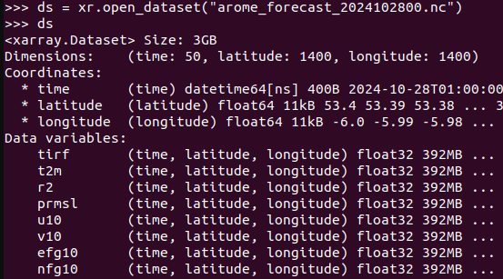
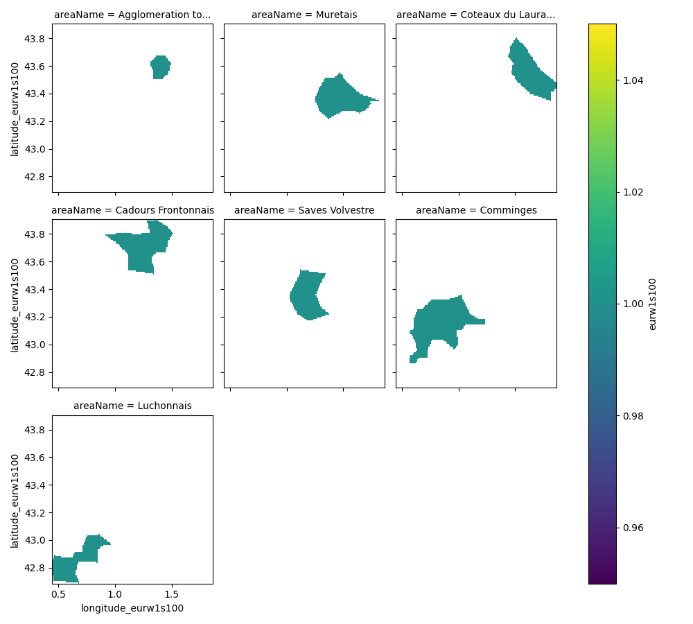

# **Projet App Meteo**

---

## Cahier des charges global

- Développer une application python permettant la lecture de données météo, leur manipulation ainsi que leur visualisation avec une mission globale donnée.

---
## Les Missions:

### 1. Prévision des risques sur cumuls de pluie
- Fournir des cumuls sur differents intervalles ( ex: 1H, 6H 12H et 24H ) 
- Créer un risque en fonction d'une combinaison de seuil (ex : RR1 > 10mm). 
  
  

### 2. Humidex et Windchill
- Création des indicateurs de température ressentie. 
Le premier est utilisé en période estivale. Le second en période hivernale. 

---

### 3. Facteur de charge éolien 
- Calculer le facteur de charge prévu d'une éolienne en fonction de la force du vent. 

### 4. Synthése de données météorologiques 
- Mettre en place l'équivalent de l'application web de MétéoFrance pour une zone donnée (ou autre par ex bulletin météo à portée nationale).


Pour chacune de ces missions, il faudra développer des visualisations spécifiques qui pourront afficher les résultats à partir de jeux de données variées et pour des zones géographiques précises.

---
# **Les données à dispositions**
Vous disposerez de trois types de données : 
- des données de prévision déterministe AROME à 1.3km de résolution (grille EUR1S100) pour des échéances allant jusqu'à 50h. 
**Nomenclature** : `arome_forecast_{day.strftime('%Y%m%d%H')}.nc`
- des données de prévision ensembliste AROME à 2.5 km de résolution (grille EUR1S040) pour des échéances allant jusqu'à 50H. L'ensemble possède 25 membres différents. Chaque membre est dans un fichier spécifique. 
**Nomenclature** : `arome_forecast_{day.strftime('%Y%m%d%H')}_mb_{str(X).zfill(3)}.nc` où X est le numéro du membre. 
- des masques (remplis de 1 et de NaN) délimitant différents types de zones géographiques (avec ou non un nom). 

---
# **Contenu des fichiers AROME**


- tirf : Pluie cumulée depuis le début de la prévision (en mm)
- r2 : Humidité relative (en %)
- prmsl : Pression ramenée au niveau de la mer (en Pa)
- u10/v10 : composantes du vent à 10m (en m/s)
- efg10/nfg10 : Composantes rafales à 10 m  (en m/s)

---
# **Les masques** 
Trois types de masques sont disponibles (sur la France Métropolitaine) : 
- Les masques de zones climatiques homogènes. Il sont dénommés 
  `zones_clim_{X}.nc` où `X` varie en fonction de la zone.
- Les masques de redécoupage de département (zones sympos). 
Ils sont dénommés `sympo_{Y}.nc` où Y est le département. 
- Des masques sur des Bassins Versants. Pour ce dernier jeu de masques, deux niveaux emboîtés sont fournis.
    - `bassin_level1.nc` : Contient les 24 bassins versant sur la métropole 
  - `bassin_level2_zone_{X}.nc` : Contient les bassins versant de la sous-zone `{X}`. 

Chaque fichier contients plusieurs masques sur une zones données. 

---
# **Les grilles** 
Chaque fichier de masques contient l'emprise des zones géographiques pour différentes grilles. 
Avec les données AROME nous n'utiliseront que les grilles `eurw1s100` et `eurw1s40`. 

---
# **Visualisation des Masques (Zones sympo pour le 31)**
<div class="columns">
<div>

```python
import xarray as xr
import matplotlib.pyplot as plt  
path = "MYPATH/masks/Sympo/sympo_31.nc"
ds = xr.open_dataset(path)
ds = ds.set_coords("areaName") # Met le nom en coord
# Change de coordonnée
ds = ds["eurw1s100"].swap_dims({"id":"areaName"})
# Affiche l'ensemble des masques du fichier (en fonction
# de la coordonée areaName). 
ds.plot(col="areaName",col_wrap=3)
plt.show() 
```
</div>
<div>



</div>
</div>

---
## **Module 1 : Configuration du Projet et de l'Environnement**


1. **Création de l'environnement virtuel** :
   - Créez un environnement virtuel Python pour ce projet et activez-le.
   - Installez toutes les bibliothèques nécessaires (`xarray`, `matplotlib`, `argparse`, `pyyaml`, etc.) en utilisant `pip`.

---

2. **Création de la structure des dossiers du projet** :
   
   **Nom_de_mon_application**/
   ├── /**sources**/
   │   ├── **`__init__`.py**
   │   ├── data_loader.py
   │   ├── data_manipulator.py
   │   ├── visualizer.py
   │   └── cli.py
   ├── input.yaml
   ├── **.gitignore**
   ├── **requirements.txt**
   └── **README.md**

   - Ne créer que les choses en **GRAS** !!
---

   - Assurez-vous d'inclure un fichier `requirements.txt` contenant toutes les dépendances du projet.( liste des bibliothèques )

   - Ajoutez au '.gitignore' la ligne '__pycache__/' ainsi que '*.nc'.
   
---

3. **Initialisation de Git** :
   - Initialisez un référentiel Git pour le projet.
   - Effectuez un premier commit pour sauvegarder la structure de base du projet.

### **Objectifs :**
- Créer un environnement de travail propre et bien structuré.
- Apprendre à utiliser `git` pour versionner le code.

---

## **Module 2 : Chargement des Données Météo avec Xarray**

### **Cahier des charges :**
1. **Loader** :
   - Créez, au travers d'une classe, un objet Loader capable de :
        - prendre en entrée un chemin vers un fichier NetCDF et en faire un dataset xarray.
        - prendre en entrée une liste de fichier NetCFD et en faire un dataset xarray.
        - Ajoutez la possibilité de prétraiter les données en sélectionnant certaines partie des données via un fichier de masque extérieur .

---
1. **Testez la classe** :
   - Créez un fichier d'exemple pour tester le bon fonctionnement de la classe en chargeant un fichier local, et en prétraitant les données.


---

## **Module 3 : Manipulation et Analyse des Données**

Créez un object capable de manipuler vos données en fonction des besoins de votre mission.

Vous pouvez commencer par discuter en groupe et écrire le détail des fonctionnalité que vous allez devoir implémenter pour mener à bien vos objectifs.

--- 

<!-- 
### **Cahier des charges :**
1. **Classe `WeatherDataManipulator`** :
   - Créez une classe `WeatherDataManipulator` qui permet de filtrer les données en fonction d’une plage temporelle (par exemple, janvier 2024).
   - Implémentez une méthode pour calculer la température moyenne sur la période sélectionnée.
   - Ajoutez une méthode pour calculer les anomalies de température par rapport à une période de référence (par exemple, 2000-2010).

2. **Testez la classe** :
   - Testez la classe en appliquant les filtres temporels et en calculant les anomalies sur un jeu de données exemple.

### **Objectifs :**
- Manipuler les jeux de données avec `xarray` pour effectuer des calculs statistiques.
- Apprendre à filtrer des données temporelles et calculer des anomalies.

---

## **Module 4 : Visualisation des Données Météo**

### **Cahier des charges :**
1. **Classe `WeatherDataVisualizer`** :
   - Créez une classe `WeatherDataVisualizer` capable d'afficher des graphiques avec `matplotlib` pour les données météo.
   - Ajoutez une méthode pour visualiser la température moyenne sur une période donnée avec un **colormap** de votre choix.
   - Ajoutez une autre méthode pour visualiser les anomalies de température avec un **colormap** différent.

2. **Testez la classe** :
   - Testez la classe en générant des graphiques pour la température moyenne et les anomalies de température à l'aide de données d'exemple.

### **Objectifs :**
- Apprendre à visualiser des données avec `matplotlib` et à personnaliser les graphiques.
- Utiliser des `colormap` pour rendre les graphiques plus intuitifs et informatifs.

---

## **Module 5 : Création de l'Interface en Ligne de Commande (CLI)**

### **Cahier des charges :**
1. **Utilisation de `argparse`** :
   - Créez un fichier `cli.py` permettant d'exécuter l'application à partir de la ligne de commande.
   - Implémentez les arguments CLI suivants :
     - `--config` : Le chemin vers le fichier de configuration YAML.
   - Le programme doit charger le fichier de configuration et exécuter les étapes suivantes en fonction des instructions données :
     - Charger les données météo.
     - Prétraiter les données selon les paramètres donnés (par exemple, remplir les valeurs manquantes).
     - Visualiser les résultats.

2. **Testez le CLI** :
   - Créez un fichier de configuration YAML exemple et testez les différentes étapes via la ligne de commande.

### **Objectifs :**
- Créer une interface simple en ligne de commande pour exécuter le programme.
- Permettre à l'utilisateur de spécifier des paramètres comme le fichier de configuration via des arguments CLI.

---

## **Module 6 : Gestion de la Configuration avec YAML**

### **Cahier des charges :**
1. **Création du fichier de configuration YAML** :
   - Créez un fichier `config.yaml` qui contient la configuration nécessaire à l'application :
     - **Dataset** : Chemin d'accès aux données (local ou distant), variables à traiter, méthode de gestion des valeurs manquantes.
     - **Processing** : Période de traitement (dates de début et de fin), période de référence pour le calcul des anomalies.
     - **Visualization** : Type de visualisation (température moyenne, anomalies), titre du graphique et colormap à utiliser.

2. **Lecture du fichier YAML** :
   - Créez une fonction dans votre programme qui lit ce fichier YAML et applique les configurations spécifiées.

### **Objectifs :**
- Gérer la configuration du programme avec un fichier YAML.
- Apprendre à manipuler les fichiers YAML avec la bibliothèque `pyyaml`.

---

## **Module 7 : Tests, Emballage et Déploiement**

### **Cahier des charges :**
1. **Tests unitaires** :
   - Écrivez des tests unitaires pour vérifier le bon fonctionnement des différentes classes (par exemple, charger les données, filtrer les dates, calculer les anomalies).
   - Utilisez un framework de test comme `unittest` ou `pytest`.

2. **Emballage et distribution** :
   - Préparez l'application pour sa distribution en créant un fichier `setup.py` avec les dépendances nécessaires et les informations sur le package.
   - Emballez l'application pour pouvoir l'installer avec `pip`.

### **Objectifs :**
- Tester le code pour assurer sa fiabilité.
- Préparer l'application pour sa distribution et son déploiement.

---

### **Consignes générales pour chaque module :**
- **Commentaires et documentation** : Chaque classe et fonction doit être bien documentée. Commentez votre code pour expliquer ce que chaque partie fait.
- **Propreté du code** : Votre code doit être lisible, bien structuré et suivre les bonnes pratiques de programmation Python (PEP 8).
- **Modularité** : Divisez votre code en petites fonctions ou méthodes qui réalisent des tâches spécifiques, ce qui rendra votre code plus maintenable et réutilisable.

---  -->
