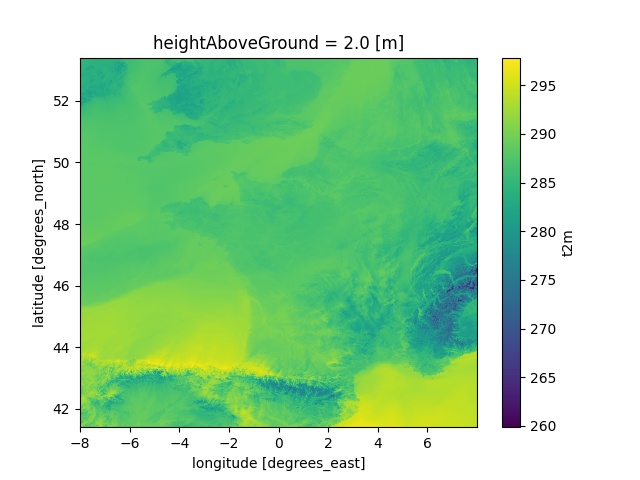
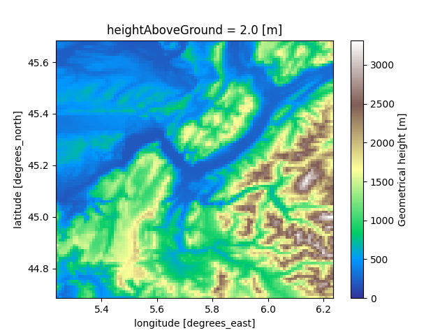
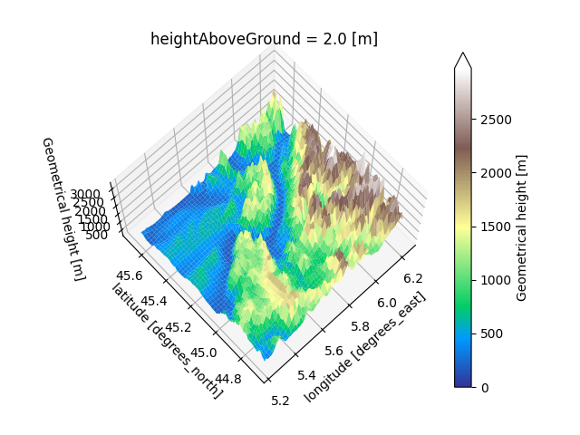

# **Cours Python : Introduction à Xarray**

---

# **Pourquoi  Xarray**

- Xarray est une bibliothèque Python pour la manipulation de données multi-dimensionnelles.
- Inspirée par **Pandas**, elle facilite l'analyse de données N-dimensionnelles.
- Elle est idéale pour travailler avec des données météorologiques indexées selon **lat**, **lon**, **time**.
- Xarray gère différents formats de données utilisés en météorologie (**netcdf**, grib, zarr) => Permet d'avoir le même code applicatif à l''ouverture du fichier prêt. 
- **Gère et propage** les métadonnées tout du long des calculs. 
  
---
## **Ajout de  bibliothèque à l'environnement existant**

Pour ce TP il vous faudra installer `xarray`, `matplotlib` et `netCDF4`. 

Pour cela : 
- Activer l'environnement virtuel créé lors du dernier TP.  
 


- Faire ensuite 
```sh 
  pip install xarray matplotlib netCDF4
```


---

# **Ouverture d'un fichier Netcdf** 

```python 
import xarray as xr 
ds = xr.open_dataset("/home/newton/ienm2021/chabotv/COURS_CS/arome_forecast_2024100900.nc")
#Affiche le contenu du fichier
print(ds)
```
----
# **Résultat de l'ouverture**
```sh 
<xarray.Dataset> Size: 69MB
Dimensions:            (latitude: 1200, longitude: 1600, time: 4)
Coordinates:
  * latitude           (latitude) float64 10kB 53.4 53.39 53.38 ... 41.42 41.41
  * longitude          (longitude) float64 13kB -8.0 -7.99 -7.98 ... 7.98 7.99
  * time               (time) datetime64[ns] 32B 2024-10-09T01:00:00 ... 2024...
    heightAboveGround  float64 8B ...
Data variables:
    altitude           (latitude, longitude) float32 8MB ...
    t2m                (time, latitude, longitude) float32 31MB ...
    r2                 (time, latitude, longitude) float32 31MB ...
Attributes:
    GRIB_edition:            2
    GRIB_centre:             lfpw
    GRIB_centreDescription:  French Weather Service - Toulouse
    GRIB_subCentre:          0
    Conventions:             CF-1.7
    institution:             French Weather Service - Toulouse
    history:                 2024-10-10T09:28 GRIB to CDM+CF via cfgrib-0.9.1...
```

----
# **Qu'avons nous chargé ?** 
Un fichier contenant trois variables : 
 - **t2m** (temperature)
 - **r2** (humidité spécifique)
 -  **altitude**

Ces variables possèdent des coordonnées (**time**, **latitude**, **longitude**)
Le fichier, ainsi que l'ensemble des variables et coordonnées, possède des attributs. 

**Ex** : `history` renseigne sur la manière dont a été créer le fichier. 

Dans le *vocabulaire* xarray, une variable particulière d'un *Dataset* s'appel un *DataArray*. 


----
# **Exercice 1**
En consultant les attributs de la variable `t2m`, retrouver en quelle unité est stockée la temperature. 

---
# **Solution 1**
```python 
print(ds["t2m"])
```

```sh
... 
Attributes: (12/30)
    GRIB_paramId:                             167
    GRIB_dataType:                            fc
    GRIB_typeOfLevel:                         heightAboveGround
    GRIB_stepUnits:                           1
    ...                                       ...
    GRIB_shortName:                           2t
    GRIB_units:                               K
    long_name:                                2 metre temperature
    units:                                    K
    standard_name:                            air_temperature
```
**NB** : Pour afficher l'ensemble des attributs faire
```python 
print(ds["time"].attrs)
```

----
# **Selection de données** 
Il y a deux manières principales de selectionner des données : 
- par valeur  
```python
 t2m_toulouse = ds["t2m"].sel(latitude=43.6,longitude=1.43,method="nearest")
``` 
`method=nearest` pemet de selectionner le point de grille le plus proche.  
- par indice
```python  
t2m_by_index = ds["t2m"].isel(latitude=198,longitude=705)
```
----
# Selection de données : par plage 
On peut aussi selectionner via une liste ou des "slices" 
```python
t2m_area = ds["t2m"].sel(latitude=slice(44,42),longitude=slice(0,2))
```

**Attention** : La sélection suivante n'aurait sélectionné aucune donnée !

```python
t2m_area = ds["t2m"].sel(latitude=slice(42,44),longitude=slice(0,2))
```
En effet, les latitudes sont rangées de manière décroissante dans ce fichier. 

----
# **Exercice 2**

1. Retrouver la position (en latitude/longitude) du point de grille situé à l'index (198,705) de l'exemple précédent. 

2. Quelle est la température à 2h du matin à Paris ? 

3. Combien de point de grille ont été selectionnés par la commande suivante 

```python
t2m_area = ds["t2m"].sel(latitude=slice(44,42),longitude=slice(0,2))
```

----
# **Solution 2**

1. Via `print(t2m_by_index)` on obtient les coordonées `[51.42,-0.95]`. En entrant ces coordonnées dans google maps, on s'aperçoit qu'il s'agit de Reading et plus spécifiquement du site du  CEP. 

2. On retrouve la position de Paris via google maps  : `[48.85, 2.35]`
```python 
t2m_paris_2h = ds["t2m"].sel(latitude=48.85,longitude=2.35, method='nearest')
print(t2m_paris_2h.values)
```
3. Voici la première ligne de `print(t2m_area)`
```sh 
xarray.DataArray 't2m' (time: 4, latitude: 200, longitude: 200)
```
On a selectionné une grille de 200x200, soit 40 000 points de grille. 

----

# **Calculs sur les données** 

On peut directement faire des calculs sur un *Dataset* ou sur un *DataArray*
```python
# Moyenne temporelle pour toutes les variables du dataset 
ds_temporal_mean = ds.mean(dim="time")
# Variation spatiale 
ds_std = ds.std(dim=["latitude","longitude"])
```
**NB** On peut aussi employer directement des fonctions `numpy` sur un `DataArray`. 
```python 
np.mean(ds["t2m"],axis=[0]) <=> ds["t2m"].mean(dim="time")
```

----
# **Exercice 3**
 
- Quelles sont les dimensions de vos variable après la moyenne temporelle ? 

- Quelle est la température moyenne sur la période sur un rectangle  
  - latitude : [42, 44]
  - longitude : [0, 2]

----
# **Solution 3** 
1. Les 3 variables (`t2m`, `r2`, `altitudes`)  ont uniquement les dimensions spatiales, i-e `latitude` et `longitude`. 
2. 
```python
print(f"La moyenne spatio temorelle sur la zone est : {t2m_area.mean().values}")
```
----
# **Visualisation rapide  (via matplotlib)** 

**Attention** : On peut uniquement utiliser la fonction de plot sur les **DataArray**.



```python 
import matplotlib.pyplot as plt 
ds_temporal_mean["t2m"].plot()
plt.show()
```
*Bonus* : On a directement accès aux coordonnées sur le plot

----
# **Exercice 4**

- Afficher l'altitude sur un carré d'un degré de côté centré autour de Grenoble. 
----
# **Solution 4**

Recherche des coordonnées de grenoble [45.19,5.73] via google maps. 

```python 
# selection de la zone 
delta = 0.5 # On prend 0.5 degré de chaque côté
altitude_grenoble = ds["altitude"].sel(
  latitude=slice(45.19 + delta, 45.19 - delta), 
  longitude=slice(5.73 - delta, 5.73 + delta))

# Création d'une carte 2D
altitude_grenoble.plot(cmap="terrain",vmin=0)
plt.show()
# Création d'une carte 3D
altitude_grenoble.plot.surface(cmap="terrain",vmin=0, extend="max")
plt.show()
```

----

# **Solution 4 : rendu** 
 

----
# **Utilisation des masques pour calculer sur des sous domaines** 

Avec *xarray* (et numpy) On peut aisément créer des masques et les utiliser. 
Cela peut ce faire comme dans l'exemple suivant avec `where` ou par simple multiplication. 

```python 
mask = ds["altitude"] > 1000 
temperature_above_1000 = ds["t2m"].where(mask)
mean = temperature_above_1000.mean()
print(f" Temperature moyenne des points ayant une altitude supérieure à 1000 m : {str(mean)} {mean.units}"))
```

```sh 
> Temperature moyenne des points ayant une altitude supérieure à 1000 m : 281.15 K
```

----

# **Exercice 5**
Faite une fonction permettant de  calculer la température moyenne d'une zone donnée pour les points situés au dessus d'une certaine altitude. 

---
# **Solution 5**
```python 
def conditional_mean(ds, lats, lons, altitude): 
    """
    Fonction permettant de faire la moyenne sur une zone donnée 
    pour les points supérieur à une altitude donnée (altitude). 
    """
    mask = ds["altitude"] > altitude
    mean_da = ds["t2m"].sel(latitude=lats, longitude=lons).where(mask).mean()
    print(f"{mean_da.long_name} mean is {str(mean_da.values.round(2))} {mean_da.units}")

lats = slice(46,44)
lons = slice(-2,2)
altitude = 500 
conditional_mean(ds, lats, lons, altitude)
```
---
# **Exercices (Optionel)**


1. Améliorer la fonction de l'exercice 5 de telle sorte à prendre en entrée la variable d'intérêt dans le dataset (par ex. `r2` ou `t2m`)
2. Combien y-a-t'il d'occurences de température négative (en °C) dans le dataset entier ? Quel pourcentage de cas cela représente-t-il ? 
3. Calculer la moyenne glissante  (sur 3h) pour la zone autour de Grenoble. (Indication : utiliser la fonctionnalité `rolling` de  *xarray*) 

